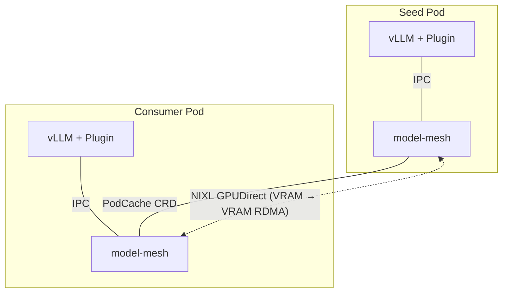
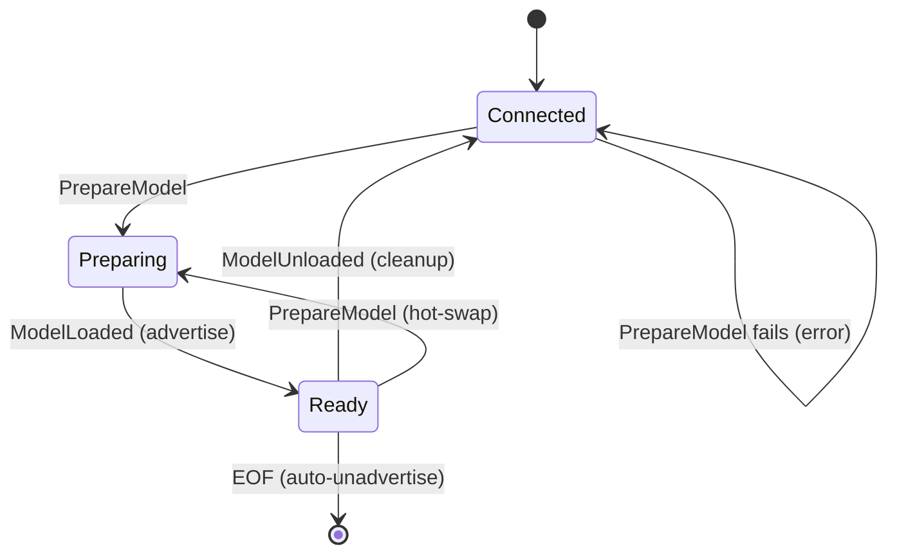

# layercast

[](https://github.com/wseaton/layercast/actions/workflows/ci.yaml)
[](https://github.com/wseaton/layercast/actions/workflows/images.yaml)
[](LICENSE-APACHE)

Distributed model weight loading for Kubernetes. Accelerates LLM cold starts by transferring weights directly between GPU VRAM via NIXL GPUDirect RDMA (UCX, UCCL, etc), bypassing disk and CPU entirely.

## How it works

A seed pod downloads the model once (from HuggingFace or a shared filesystem). Every subsequent pod pulls weights straight from the seed's GPU memory over InfiniBand, with multi-peer transfers scaling across available RDMA paths.

Additionally, we also have infrastructure for torch.compile cache propagation between peers, so the second consumer onwards skips codegen entirely. This is done by implementing the remote torch dynamo Redis cache API but backed by cooperative peering.



## Weight loading cascade

The vLLM plugin tries each source in priority order, falling through on failure:

1. **NIXL GPUDirect** - VRAM-to-VRAM transfer from peer pods (~27 GB/s multi-peer over IB)
2. **vLLM default** - HuggingFace download or shared filesystem read

## Benchmark results (Qwen2.5-32B, CoreWeave H200 SXM)

Weight transfer throughput over InfiniBand (ConnectX-7 400 Gb/s) with NIXL GPUDirect RDMA:

| Scenario | Weight Load | Throughput | Notes |
|----------|-------------|------------|-------|
| Single peer (c1 from seed) | ~20s | 8-9 GB/s | One RDMA path |
| Multi-peer (c2 from seed + c1) | ~20s | ~27 GB/s | Parallel transfers across separate NICs |
| RDMA wire speed (multi-peer) | 1.6s | ~40 GB/s | Raw transfer excluding setup/checksum |

Multi-peer transfers use LPT bin-packing to split tensors across available peers, issuing parallel RDMA reads. Pods must land on separate nodes (anti-affinity) for separate NIC paths; same-node peers share a PCIe link and don't benefit from parallelism.

Actual time-to-ready includes vLLM startup (~17s) and optional torch.compile. The compile cache eliminates codegen for the second consumer onwards.

## Project structure

```
crates/
  discovery/       K8s peer discovery (PodCache CRD, kube-rs reflectors)
  model-mesh/      Sidecar daemon (IPC server, HTTP metadata API, compile cache)
vllm-plugin/       vLLM plugin (model loader, NIXL agent, checksum verification)
deploy/
  benchmark/       Benchmark scenarios (NFS, NIXL scaling)
  nixl-e2e/        End-to-end NIXL deployment (kustomize)
```

| Crate | Description |
|-------|-------------|
| **discovery** | Peer discovery via K8s PodCache CRD and kube-rs reflectors. Tracks model peers and compile cache namespaces. |
| **model-mesh** | IPC daemon for the vLLM plugin. HTTP server for peer metadata exchange, RESP2 shim for torch.compile P2P cache. |

## Sidecar HTTP API

The model-mesh sidecar exposes an HTTP server (default port 8081):

| Endpoint | Purpose |
|----------|---------|
| `GET /healthz` | Readiness probe (503 until init complete, then 200) |
| `GET /health` | Liveness check |
| `GET /internal/nixl-vram/:agent` | Fetch NIXL VRAM metadata for a peer |
| `GET /internal/compile-cache/:key` | Fetch compile cache entry from peer |
| `GET /internal/compile-cache-stats` | Compile cache hit/miss counters |

## IPC protocol

The vLLM plugin communicates with the sidecar over a Unix domain socket using length-prefixed msgpack. Three messages form a per-connection state machine:



## Configuration

### model-mesh sidecar

| Variable | Default | Description |
|----------|---------|-------------|
| `POD_NAME` | *(required)* | Pod name (K8s downward API) |
| `POD_IP` | *(required)* | Pod IP address (K8s downward API) |
| `POD_NAMESPACE` | `layercast-system` | Pod namespace (K8s downward API) |
| `NODE_NAME` | `localhost` | Node name (K8s downward API) |
| `LISTEN_ADDR` | `0.0.0.0:8081` | HTTP server bind address |
| `IPC_SOCKET_PATH` | `/var/run/layercast/daemon.sock` | Unix socket for vLLM IPC |
| `HF_UPSTREAM` | `https://huggingface.co` | HuggingFace Hub URL (file listing) |
| `NIXL_CONTROL_PORT` | `7903` | TCP port for NIXL metadata exchange |
| `MODEL_NAME` | *(none)* | Pre-fetch file list at boot (predictive cache) |
| `PEER_DISCOVERY_TIMEOUT` | `120` | Seconds to poll for peers (0 = skip, for seeds) |
| `COMPILE_CACHE_ENABLED` | `false` | Enable torch.compile P2P cache |
| `COMPILE_CACHE_ADDR` | `127.0.0.1:6379` | RESP2 shim listen address |
| `COMPILE_CACHE_DIR` | `/var/cache/layercast/compile-cache` | On-disk compile cache directory |
| `COMPILE_CACHE_MAX_MEMORY` | `512MB` | Max memory for in-memory compile cache |
| `GPU_PRODUCT` | *(auto-detected)* | GPU identifier (e.g. `NVIDIA-H100-SXM5-80GB`) |
| `IMAGE_DIGEST` | *(none)* | Container image digest for compile cache namespace |

### vLLM plugin

| Variable | Default | Description |
|----------|---------|-------------|
| `LAYERCAST_SOCKET` | `/var/run/layercast/daemon.sock` | Path to sidecar IPC socket |
| `LAYERCAST_CHECKSUM` | `true` | Verify safetensor checksums after transfer |
| `LAYERCAST_COALESCE_THRESHOLD` | `1MB` | Coalesce NIXL transfers below this size |
| `LAYERCAST_NIXL_NUM_THREADS` | `4` | Number of NIXL transfer threads |
| `LAYERCAST_IB_SL` | `1` | InfiniBand service level |
| `LAYERCAST_PARALLEL_PEER_XFER` | `1` | Parallel multi-peer RDMA transfers (0 to serialize) |
| `LAYERCAST_TRANSFER_TIMEOUT` | `120` | Max seconds per NIXL transfer before timeout |
| `HF_TOKEN` | *(none)* | HuggingFace token for gated model access |

## Quick start

```bash
# Build the sidecar
cargo build --release

# Install the vLLM plugin
pip install ./vllm-plugin

# Run vLLM with layercast
vllm serve --load-format layercast --model Qwen/Qwen2.5-32B
```

## Deploy to Kubernetes

```bash
# Apply the NIXL end-to-end setup (edit kustomization.yaml for your registry)
kubectl apply -k deploy/nixl-e2e/

# Run benchmarks
./scripts/benchmark.sh --skip-hf --skip-populate
```

## Development

```bash
# Format + lint
cargo fmt --all
cargo clippy --all --benches --tests --examples --all-features

# Run Rust tests
cargo test --all

# Run Python tests
cd vllm-plugin && uv run pytest tests/ -v

# Generate the PodCache CRD YAML
cargo run -p discovery --bin crd-gen
```

## License

Dual-licensed under [Apache 2.0](LICENSE-APACHE) or [MIT](LICENSE-MIT), at your option.
